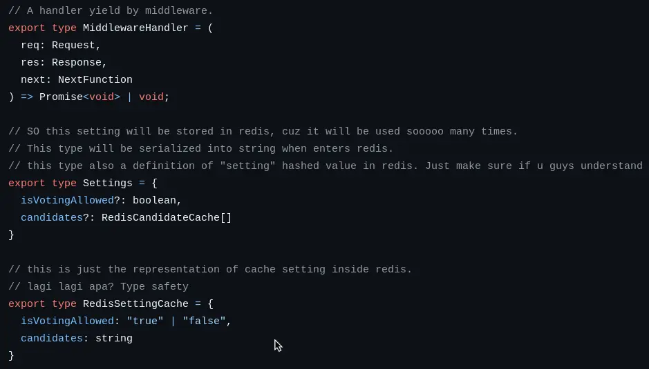

+++

title = "Crappy code"
date = 2026-09-25
description = "Why the half of my repo are full of crap?"

[taxonomies]
tags = ["devlog"]

+++

The simplest answer I can provide is: Because it is my code.

The first time I wrote those line of codes, my heart was full of confidence and I already sees myself working in the FAANG company later in years. But now it turned out to be a fucking abomination, this code was so bad it makes me puke myself. I wonder what am I thinking when I wrote this code.

The gap of perspective change was HUGE, but the gap of time remains short, I this code like a year ago and it's already make me puke and curse myself.

Apart from my experience, this happened because **my eyes are used to see good codes**.

This year, I am using AI in my workflow for **A LOT**. I feel I can't finish a project without it. It makes me produce good programs, that are solid as wall, implements best practices, and having an elusive limit/boundary. Because of this, now I'm allergic to bad codes, even my own that I wrote myself.

My past self may hate Vibe Coder, but here I am now, sitting while writing a bunch of prompts without looking at the source code. The bar nowadays was so high it makes traditional coder surrender (I guess I will write something about this topic later).

Vibe coding was so fun, but it is not because my code works, it is because I can finish something in such speed. Very satisfying indeed but at the same time, I felt empty inside.

Something's missing.

Then I realized what's missing, it was the feeling when my code works and reached the bar. Not something else's code, but MY CODE. This crappy code that I wrote line by line, indeed it was full of flaw, but it fulfilled the requirement and more importantly: it was my code. I wasn't justifying bad codes by labeling it with originality, I was normalizing the process of **trying**... MANUALLY trying.

So if you see a repository of mine that contains Crappy code, it was my history of struggle, a sign of my effort.

 
